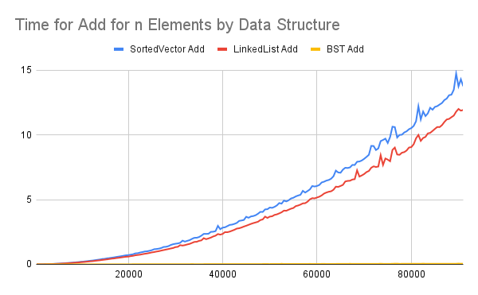
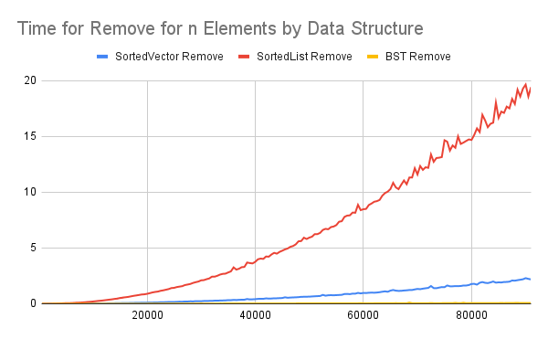
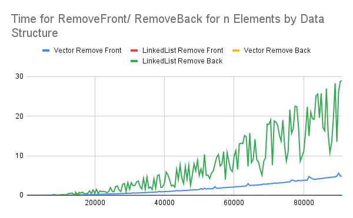
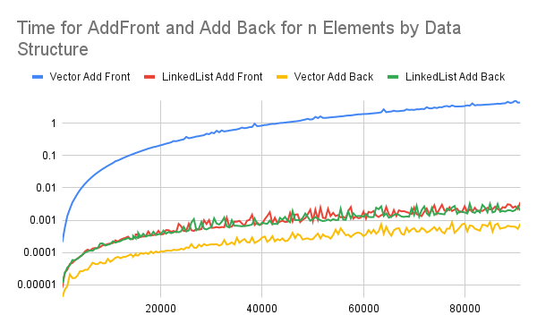

# Report for Data Structure Speed Comparison Homework

## Algorithmic Analysis - Big $O$
The following depicts Big $O$ for various functions by data structure.  

### Big $O$ Table

| - | Add/Insert | Remove | Search/Find | Sort | Add Front | Add Back | Remove Front | Remove Back | Get by Index |
| --- | --- | --- | --- | --- | --- | --- | --- | --- | --- |
| Vector | $O(n)$ | $O(n)$ | $O(n)$ | $O(n log n)$ | $O(n)$ | $amortizedO(1)$ | $O(n)$ | $O(1)$ | $O(1)$ |
| Single Linked List | $O(n)$ | $O(n)$ | $O(n)$ | $O(n log n)$ | $O(1)$ | $O(1)$ | $O(1)$ | $O(1)$ | $O(n)$ |
| Double Linked List | $O(n)$ | $O(n)$ | $O(n)$ | $O(n log n)$ | $O(1)$ | $O(1)$ | $O(1)$ | $O(1)$ | $O(n)$ |
| Sorted Vector | $O(n)$ | $O(log n)$* | $O(log(n))$ | $O(1)$ | --- | --- | --- | --- | --- |
| Sorted Single Linked List | $O(1)$ | $O(1)$ | $O(log(n))$ | $O(1)$ | --- | --- | --- | --- | --- |
| Sorted Double Linked List | $O(1)$ | $O(1)$ | $O(log(n))$ | $O(1)$ | --- | --- | --- | --- | --- |
| Binary Search Tree | $O(log(n))$ | $O(log(n))$ | $O(log(n))$ |  | --- | --- | --- | --- | --- |

*  This removal is based on using a binary search (not linear search.)

[1]


### Assumptions with Sort

*Since the worst case can change considerably based on what sort you use for sorting (if any), list each algorithm below, and specify the algorithm used in your assumption.  For BST, write which method of traversal you would use to sort it.*

- Vector
    - Quicksort or Mergesort (depends on space complexity / size)
- Single Linked List
    - Mergesort
- Double Linked List
    - Mergesort
- Sorted Vector - already sorted
    - n/a
- Sorted Single Linked List - already sorted
    - n/a
- Sorted Double Linked List - already sorted
    - n/a
- Binary Search Tree
    - In order

### Worst Case vs. Average Case

*There are a few functions whose worse case is very different than the average case. Name at least two of them, and explain why the worse case is so much worse than the average case.*

1. Sort using Quicksort: The worst case for quicksort $O(n^2)$ is when the pivot is selected poorly (for example highest or lowest). This is because quicksort uses partitions and if they are very unbalanced it loses benefits of dividing and conquering. 
2. Vector AddToBack: The worst case for AddToBack for a vector that has run out of capacity is $O(n)$ which is significantly worse that $O(1)$. This is because in that scenario, the array has to be doubled (or otherwise increased) in size and all the elements of the original array need to be copied into the new array. 

## Empirical Analysis - Speed Comparison

### Empirical Results Table

<!-- Add a link from this document to the CSV file you generated. The CSV file must have at least 15 different N values, but often can have a lot more depending on what you ran. -->
I ran this speed comparison for 100k movies with an increment of 500. The full results used in the charts can be seen here: 
[Empirical Results table](results_100k.csv)

### Analysis
### Graphic 1: Time to `Add` by Data Structure

This chart depicts the time to add n elements by data structure. It demonstrates that adding to a linked list is slightly faster than adding to a sorted vector. As noted in the chart above, these are both $O(n)$. On the other hand, adding to a binary sort tree is significantly faster, as noted by the yellow line just above the x-axis. As noted in the chart above, this is $O(log(n))$.



### Graphic 2: Time to `Remove` by Data Structure

This chart depicts the time to remove n elements by data structure. It demonstrates that removing elements from a binary search tree is the fastest ($O(log(n))$), followed by removing elements from a sorted vector $O(log \ n)$ which is leveraging a binary search. The slowest is removing elements from a sorted linked list (noted as SortedList here) at $O(n)$ which in this implementation is using a linear search. 



### Graphics 3 & 4: Adding and Removing from the Front and Back by Data Structure

The following chart shows run time for Removing from the Front and Removing from the Back by data structure. What it clearly shows is that removing from the back of a linked list and removing from the front of a vector are the most expensive operations. Removing from the back of a vector and removing from the front of a linked list are barely visible just above the x-axis. 



This chart depicts the times to add to the front or back of a linked list or vector and uses log scale. It demonstrates that adding to the front of a vector is the most time consuming operation, at $O(n)$ while adding to the front or back of a linked list and adding to the back of a vector are all $O(1)$. 



## Critical Thought

### Data Evaluation

1. What is the most surprising result from the data? Why is it surprising?
    
    At first, I was surprised when I looked at the chart I produced for Graphic 2: Time to `Remove` by Data Structure. I was confused about why removing from a sorted vector was so much faster than removing from a sorted linked list. If we were just traversing both lists with a linear search until we found the title, they should be the same. I looked back at the code and remembered that remove for the sorted vector leveraged a binary search instead of a linear search, making it much more efficient. It was a good demonstration of how the pairing of a data structure and an algorithm produce different results. 
    
2. What data structure is the fast at adding elements (sorted)? Why do you think that is?
    
    The binary search tree is the fastest at adding elements. 
    
3. What data structure is the fastest at removing elements (sorted)? Why do you think that is?
    
    The sorted vector was the fastest at removing elements. This is because it leveraged a binary search. 
    
4. What data structure is the fastest at searching? Why do you think that is?
    
    BST and Sorted Vector were the fastest at searching — this is because they are already at least partially sorted. The linked list, on the other hand, requires traversal of the list. 
    
5. What data structure is the fastest for adding elements to the front? Why do you think that is?
    
    The linked list is the fastest at adding elements to the front, because it only requires adding a node and adjusting pointers. Adding to the front of the vector, on the other hand, requires moving every other element over one spot. 
    
6. What data structure is the fastest for adding elements to the back? Why do you think that is?
    
    The vector is the fastest for adding elements to the back. That’s because vectors allow for random access to any element, including the final index, with $o(1)$. 
    
7. What data structure is the fastest for removing elements from the front? Why do you think that is?
    
    The linked list is the fasted for removing elements from the front because it only requires removing a node and adjusting pointers.
    
8. What data structure is the fastest for removing elements from the back? Why do you think that is?
    
    The vector is the fastest for removing elements from the back. That’s because vectors allow for random access to any element, including the final index, with $o(1)$. 
    

### Deeper Thinking

### Double Linked List vs Single Linked List

1. If you wrote your linked list as a single linked list, removing from the back was expensive. If you wrote it as a double linked list, removing from the back was cheap. Why do you think that is?
    1. This is because there is a tail which provides immediate access to the last element of the list without traversal. 
2. When running most functions, at least ~30% of the tests were worse case scenarios. Why do you think that is?
    1. The tests set a portion of to potential worst case scenarios to account for potential differences between data structures. This is probably especially helpful for smaller sample sizes that might randomly have no or few worst case scenarios included otherwise. 
3. What was done in the code to encourage that?
    1. The code split the sample to ensure that while 70% of the movies were in the structure, 30% may or may not have been in the data structure.
4. How did this particularly influence the linked list searches?
    1. For linked lists, this means the entire list needs to be traversed before returning null/not found.

### Test Bias

1. The tests were inherently biased towards the BST to perform better due the setup of the experiment. Explain why this is the case. (hint: think about the randomization of the data, and the worst case scenario for BST).
    1. A BST is already partially sorted due to its structure. There is no scenario in which every element has a random relationship to the previous element; some sorting (less than/greater than) has already happened. 
2. What would generate the worst case scenery for a BST?
    1. A very unbalanced tree generates the worst scenario (i.e. all elements added to the left). This basically becomes a linked list. This happens when data is sorted or almost sorted. 
3. Researching beyond the module, how would one fix a BST so the worst case scenario matches (or at least i closer to) the average case.[^1^]
    1. Implementing an algorithm that balances the tree is avoids the worst case scenario. Red-Black tress or AVL trees are examples of this. 

## Scenario

Fill out the table below. This is a common technical interview topic!

| Structure | Good to use when | Bad to use when |
| --- | --- | --- |
| Vector | You need frequent random access | You need to frequently increase size, have space complexity concerns, or when you need to frequently insert / remove elements. |
| Linked List | Good for stacks with frequent front only access | You need frequent random access, or you need to search frequently |
| Sorted Vector | When values coming in are already mostly sorted and we need quick search access. | When space is limited and the dataset is extremely large causing memory to swap. |
| Sorted Linked List | You need to frequently increase size or have an unknown size, when you need to frequently insert / remove elements at the beginning or end. | You need frequent random access, or you need to search frequently |
| BST | You need to frequently search through the data or frequently add / remove elements | data is presorted |

## Conclusion

The exercise was helpful in demonstrating how data structures and algorithms work together. The time charts especially made it clear why Stacks/Queues are particularly well sorted for some data structures and not others (the expense of adding to/removing from the front or back can really vary by data structure.  

## Technical Interview Practice Questions

*For both these questions, are you are free to use what you did as the last section on the team activities/answered as a group, or you can use a different question.*

1. Select one technical interview question (this module or previous) from the [technical interview list](https://github.com/CS5008-khoury/Resources/blob/main/TechInterviewQuestions.md) below and answer it in a few sentences. You can use any resource you like to answer the question.
    1. Dynamic Programming solves a common recursive issue of repeated calculations. So, when would we want to use recursion instead of Dynamic Programming?
        1. We use recursion instead of dynamic programming when the result of each recursive call does not depend on recalculating the previous recursion. 
            1. Taking the Fibonacci sequence, for example, each nth number depends on the result of the previous recursive call and so on, resulting in repeatedly calculating the same result. This is a good use of dynamic programming and a bad use of recursion. 
            2. Taking the example of traversing a tree, on the other hand, each recursive call is not overlapping with the other. This ensures that we’re not repeatedly running the same call. 
2. Select one coding question (this module or previous) from the [coding practice repository](https://github.com/CS5008-khoury/Resources/blob/main/LeetCodePractice.md) and include a c file with that code with your submission. Make sure to add comments on what you learned, and if you compared your solution with others.
    1. I spent a fair amount of time messing around with a `previous` variable to then realize that subtracting from the index worked just as well. 

```python
int removeDuplicates(int* nums, int numsSize) {
    if (numsSize == 0) {
        return 0;
    }
    int k = 1;
    for(int i = 1; i < numsSize; i++) {
        if(nums[i] != nums[i-1]) {
            nums[k] = nums[i];
            k++;
        }
    }
    return k;
}
```

## References

*Add your references here. A good reference includes an inline citation, such as [1] , and then down in your references section, you include the full details of the reference. Computer Science research often uses [IEEE](https://www.ieee.org/content/dam/ieee-org/ieee/web/org/conferences/style_references_manual.pdf) or [ACM Reference format](https://www.acm.org/publications/authors/reference-formatting).*

[1] Drowell, Eric. Big-O Algorithm Complexity Cheat Sheet (Know Thy Complexities!). Retrieved November 1, 2025 from [https://www.bigocheatsheet.com/](https://www.bigocheatsheet.com/)

[^1^]: Implementing a BST with a self-balancing algorithm, such as AVL or Red-Black Trees is a great research paper topic!

<!-- links moved to bottom for easier reading in plain text (btw, this a comment that doesn't show in the webpage generated-->